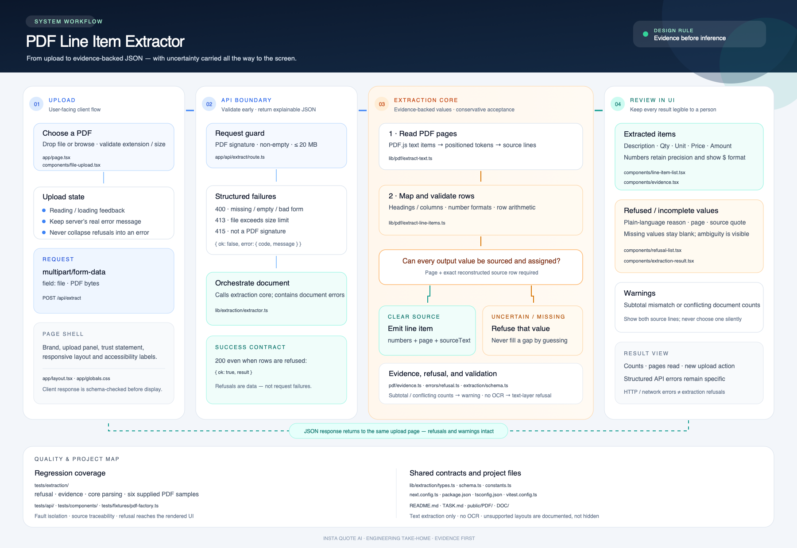

# PDF Line Item Extractor

A small web app and conservative PDF-to-JSON extraction service for invoices, packing lists, and delivery documents. It uses PDF text positioning and explicit table headings; it does not use OCR or an AI model. A value is emitted only when its source row can be identified, and every extracted item includes its page and reconstructed source line.

## Tech stack

- **Language:** TypeScript
- **Web framework and UI:** Next.js 16.3 with the App Router and React 19.2
- **Styling:** Tailwind CSS 4
- **API:** Next.js Route Handler (`POST /api/extract`)
- **PDF text extraction:** PDF.js (`pdfjs-dist` 6.3); OCR is not included
- **Schema validation:** Zod 4
- **Testing:** Vitest 5; `pdf-lib` generates test PDFs
- **Runtime/deployment:** Node.js 24; Docker multi-stage build with Next.js standalone output on Alpine, orchestrated locally with Docker Compose

The service has no database or external AI service.

## Project workflow



[Open the scalable SVG diagram](DOC/pdf-line-item-extractor-workflow.svg).

[Read the ASCII code walkthrough](DOC/EXTRACTION-WALKTHROUGH.txt).

## Run locally

Requirements: Node.js 22.13+ (Node.js 24 recommended).

```bash
npm install
npm run dev
```

## Run with Docker

The multi-stage Docker build uses Next.js standalone output and an Alpine
runtime image. Tests, documentation, local build output, and the supplied
`public/PDF` samples are excluded from the Docker build context.

```bash
docker compose up --build -d
docker compose ps
```

Open `http://localhost:3002`. The container listens on port 3000 internally and
is published on host port 3002. It runs as a non-root user, has a
Docker health check at `/api/health`, and Compose restarts it unless it was
explicitly stopped. To stop it, run `docker compose down`.

If host port 3002 is already in use, set another port, for example:

```bash
APP_PORT=3003 docker compose up --build -d
```

To build without Compose:

```bash
docker build -t pdf-line-item-extractor:local .
docker run --rm -p 3002:3000 pdf-line-item-extractor:local
```

Part A is available at `POST /api/extract`. Send a multipart form field named `file` containing a PDF:

```bash
curl -X POST http://localhost:3000/api/extract \
  -F 'file=@./invoice.pdf'
```

Successful processing returns HTTP 200, including when some rows are refused:

```json
{
  "ok": true,
  "result": {
    "document": { "fileName": "invoice.pdf", "pageCount": 1 },
    "items": [
      {
        "id": "item-1-1",
        "description": "Copper pipe",
        "quantity": 2,
        "unit": "m",
        "unitPrice": 10,
        "lineAmount": 20,
        "currency": null,
        "evidence": { "page": 1, "sourceText": "Copper pipe 2 m $10.00 $20.00" }
      }
    ],
    "refusals": [],
    "warnings": [],
    "stats": { "pagesRead": 1, "linesRead": 3, "candidateRows": 1 }
  }
}
```

Upload/request failures return a non-2xx response with `{ "ok": false, "error": { "code", "message" } }`. Document-level problems such as encrypted, malformed, or image-only PDFs are returned as structured refusals so callers can display the reason.

The upload page is available at `http://localhost:3002`. Drop a PDF onto the upload area or browse for a file. The results show extracted values, expandable evidence, subtotal warnings, and plain-language notes for refused values. HTTP/API errors retain the service's message, and network failures explain that the service could not be reached.

## Extraction behavior and current limits

- The upload is limited to 20 MB and 100 pages.
- PDFs must contain a readable text layer. Scanned/image-only pages are refused; OCR is not implemented.
- Table extraction requires recognizable description and quantity headings plus a unit-price or amount heading. When the document has no line-amount column, available quantity and unit-price values may be returned with a `null` line amount and a refusal. Headerless rows are considered only when exactly three numbers are present and quantity × unit price agrees with the printed line amount.
- Values in an explicitly headed `Weight` column are not treated as quote quantities; the source line is returned with a separate refusal for the unsupported weight.
- Ambiguous number formats (for example, `1.234`) are refused. Comma grouping follows the AU/NZ convention; a bare dollar symbol does not identify a currency, so `currency` remains `null` unless an explicit `NZD`, `AUD`, or `USD` code is attached to an extracted numeric token.
- If a mapped row is missing a numeric value, present values may still be returned with the missing field as `null` and an accompanying refusal. A row whose math contradicts its printed line amount is refused as a whole.
- Printed subtotals are compared with extracted line amounts when all candidate rows were complete. Differences are returned as warnings, not silently reconciled. Conflicting carton, box, or pallet counts in summary/warehouse notes are also surfaced with both source lines.
- Evidence text is reconstructed in left-to-right order from PDF.js text fragments on the cited page. It is not a byte-for-byte substring of the PDF file.
- Page parsing failures are isolated; readable pages and rows continue to be processed. Pages without readable text in an otherwise readable PDF are called out individually.

These rules intentionally favor omissions and visible refusals over confident-looking guesses. Real customer files may use layouts or number conventions this parser does not recognize.

## Checks

```bash
npm test
npm run lint
npx tsc --noEmit
npm run build
```

Tests create small PDFs in memory to check evidence, ambiguity, missing values, line-total contradictions, subtotal warnings, and the HTTP upload contract. There are also six regression cases for the supplied assessment PDFs. They all run in this workspace; because the sample PDFs are local untracked files, those cases are skipped in a fresh checkout until the PDFs are placed in `public/PDF`.

## Assessment notes

### Hardest decision

The hardest decision was how much to infer when table headings are absent. I chose to require explicit column headings, except for a headerless row with exactly three values whose arithmetic is consistent. A plausible quantity or amount is not enough evidence to determine what the number means.

### Where I am not confident

I am not confident this layout-based parser will handle PDF generators beyond the six tested samples, especially rotated text, multi-line item descriptions, merged cells, or unusual fonts. Column positions are inferred from PDF.js text coordinates with simple per-page anchors and tolerances; the six fixtures validate these heuristics only for their layouts.

### What I would do with three more days

The six supplied PDFs now have regression coverage. With three more days, I would broaden the test corpus with additional layouts, refine per-page header detection based on those cases, and add browser-level tests for upload, loading, refusal, warning, and retry states. I would also collect metrics on refusal categories and unsupported layouts before widening the parser's acceptance rules.
